# Guida Completa ai Diagrammi Mermaid (con focus ER)

> Basata sul materiale di [angelogalantiscuola/IT](https://github.com/angelogalantiscuola/IT) e [angelogalantiscuola/2526_5M](https://github.com/angelogalantiscuola/2526_5M)

---

## Indice

1. [Cos'è Mermaid?](#1-cosè-mermaid)
2. [Diagrammi ER — Teoria](#2-diagrammi-er--teoria)
3. [Sintassi Mermaid ER — Completa](#3-sintassi-mermaid-er--completa)
4. [Cardinalità e Notazioni](#4-cardinalità-e-notazioni)
5. [Attributi e Tipi](#5-attributi-e-tipi)
6. [Regole di Traduzione ER → SQL](#6-regole-di-traduzione-er--sql)
7. [Altri Tipi di Diagrammi Mermaid](#7-altri-tipi-di-diagrammi-mermaid)
8. [Errori Comuni](#8-errori-comuni)

---

## 1. Cos'è Mermaid?

**Mermaid** è un linguaggio testuale per creare diagrammi e grafici direttamente in Markdown. Invece di disegnare con un programma, scrivi del testo e il diagramma viene generato automaticamente.

È supportato nativamente da:
- GitHub (nei file `.md`)
- GitLab
- Notion, Obsidian
- VS Code (con estensione)

### Come si usa

In un file Markdown, si racchiude il codice Mermaid in un blocco di codice con il tag `mermaid`:

````markdown
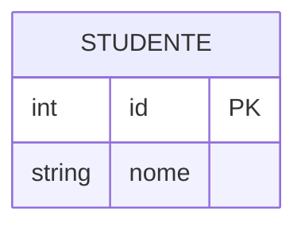
````

---

## 2. Diagrammi ER — Teoria

Un **Diagramma Entità-Relazione (ER)** è uno strumento visuale per progettare la struttura di un database **prima** di scrivere il codice SQL.

### Componenti principali

| Componente | Simbolo nel diagramma | Significato |
|---|---|---|
| **Entità** | Rettangolo con nome | Una "cosa" del mondo reale (es. Studente, Corso) |
| **Attributo** | Campo dentro l'entità | Una proprietà dell'entità (es. nome, data) |
| **Relazione** | Linea che collega entità | Come due entità si collegano (es. "frequenta") |
| **Chiave Primaria (PK)** | Attributo marcato `PK` | Identificatore univoco della riga |
| **Chiave Esterna (FK)** | Attributo marcato `FK` | Collegamento a un'altra tabella |

### Perché usare i diagrammi ER?

Prima di scrivere SQL, il diagramma ER ti permette di:
- Capire **cosa** devi memorizzare
- Trovare le **relazioni** tra i dati
- Evitare **ridondanze** e **anomalie**

---

## 3. Sintassi Mermaid ER — Completa

### 3.1 Struttura di base

```mermaid
erDiagram
    NOME_ENTITA {
        tipo attributo MODIFICATORE
    }
```

### 3.2 Entità singola con attributi

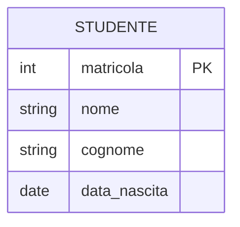

**Spiegazione:**
- `int` → tipo di dato intero
- `string` → testo
- `date` → data
- `PK` → Primary Key (chiave primaria, deve essere unica)

### 3.3 Due entità con relazione

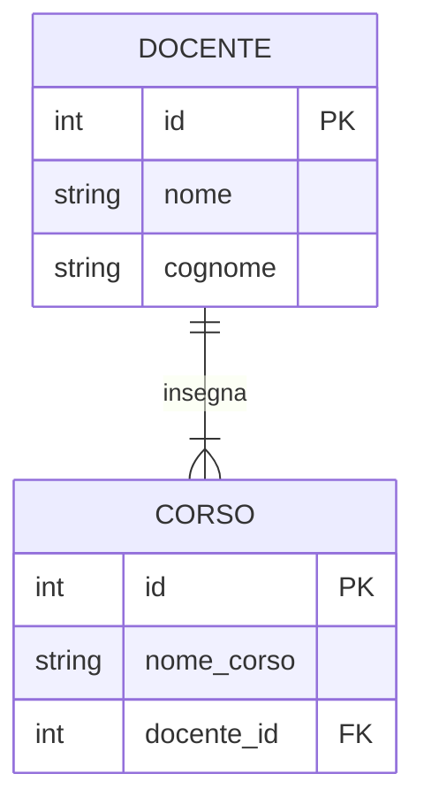

**Come leggere:** "Un DOCENTE insegna uno o più CORSI"

### 3.4 Relazione molti-a-molti con tabella di raccordo

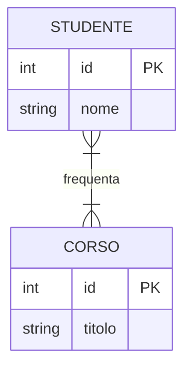

Oppure con la tabella di raccordo esplicita:

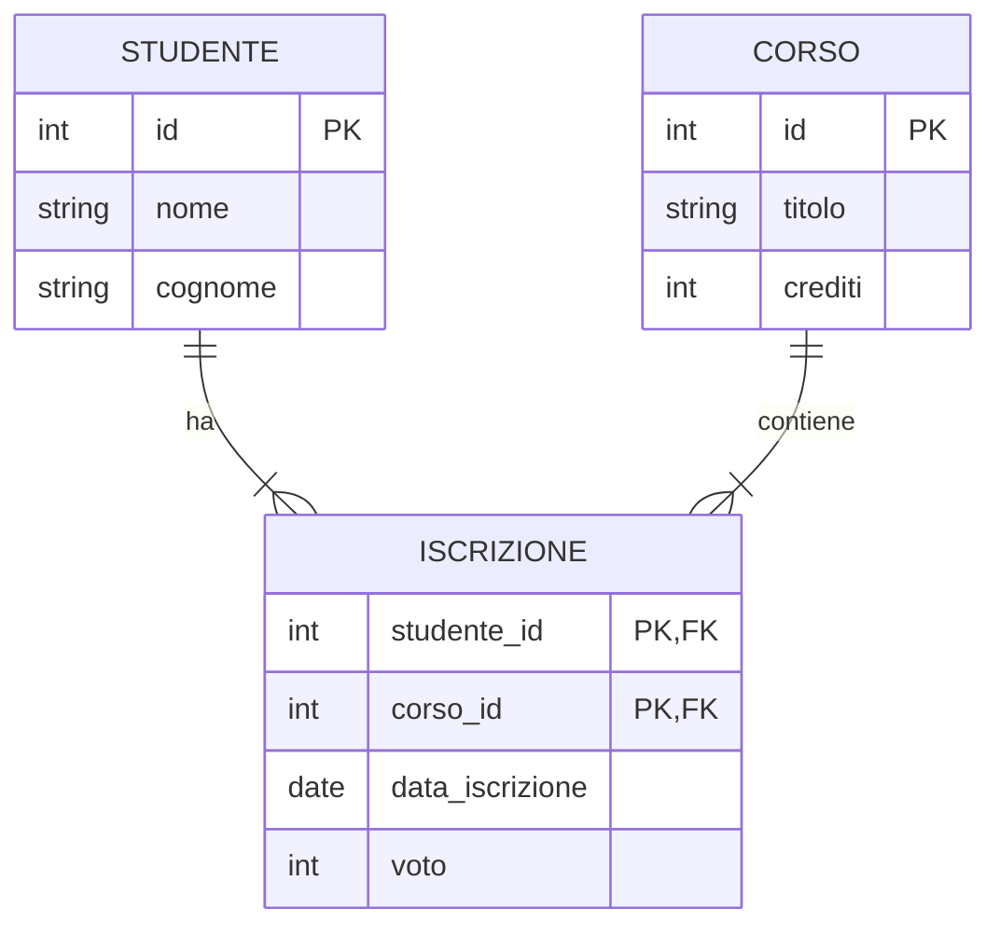

---

## 4. Cardinalità e Notazioni

La **cardinalità** descrive quante istanze di un'entità possono essere collegate a un'altra.

### Tabella delle notazioni

| Sintassi Mermaid | Significato | Lettura |
|---|---|---|
| `||` | Esattamente uno | "uno e solo uno" |
| `|{` | Uno o più | "uno o molti" |
| `}|` | Uno o più (dalla parte destra) | — |
| `o|` | Zero o uno | "zero o uno" |
| `o{` | Zero o più | "zero o molti" |
| `}{` | Uno o più (entrambi i lati) | — |

### Esempi pratici

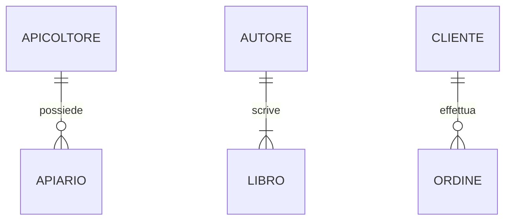

### Come si legge una relazione completa

```
ENTITA_A  [simbolo_sinistro]--[simbolo_destro]  ENTITA_B : verbo
```

Esempio: `DOCENTE ||--|{ CORSO : insegna`
- `||` → il docente è **esattamente uno** (lato docente)
- `|{` → ci sono **uno o più** corsi (lato corso)
- Lettura: "Un docente insegna uno o più corsi; ogni corso è insegnato da esattamente un docente"

---

## 5. Attributi e Tipi

### Tipi di dato comuni in Mermaid ER

| Tipo Mermaid | Corrisponde in SQL | Uso |
|---|---|---|
| `int` | `INTEGER` | Numeri interi (id, età, voto) |
| `string` | `VARCHAR(n)` / `TEXT` | Testo (nome, titolo) |
| `float` | `REAL` | Numeri decimali (prezzo, superficie) |
| `date` | `DATE` | Date (data_nascita, data_prestito) |
| `boolean` | `INTEGER` (0/1) in SQLite | Vero/falso |

### Modificatori degli attributi

| Modificatore | Significato |
|---|---|
| `PK` | Primary Key — identificatore univoco |
| `FK` | Foreign Key — riferimento ad altra tabella |
| `UK` | Unique Key — valore unico ma non PK |
| `PK, FK` | È sia PK che FK (tabelle di raccordo) |

### Esempio completo con tutti i modificatori

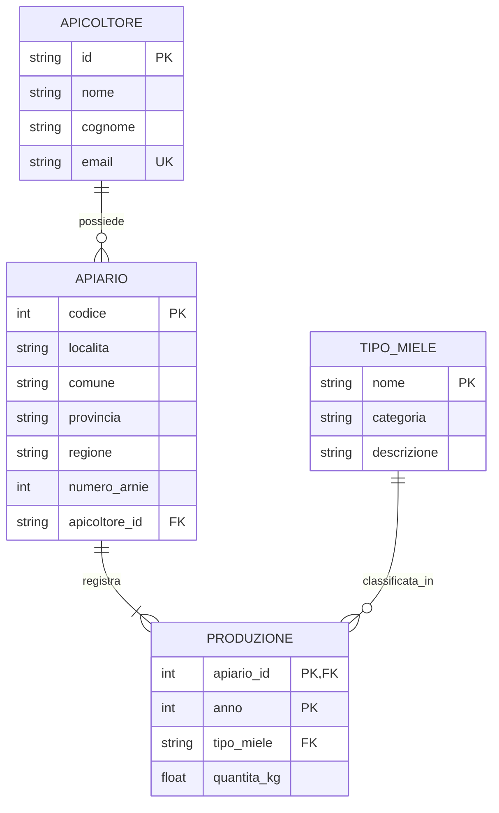

---

## 6. Regole di Traduzione ER → SQL

Queste regole vengono dal materiale del prof (file `06a_Da_ER_a_SQL_La_Guida_Pratica.md`).

### Regola 1: Ogni Entità → una Tabella

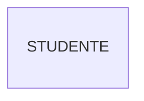
Diventa:
```sql
CREATE TABLE Studente (
    -- le colonne vanno qui
);
```

### Regola 2: Ogni Attributo → una Colonna


Diventa:
```sql
CREATE TABLE Studente (
    matricola INTEGER PRIMARY KEY,
    nome      TEXT NOT NULL,
    cognome   TEXT NOT NULL,
    data_nascita DATE
);
```

### Regola 3: Relazione 1-a-N → Foreign Key nella tabella "molti"

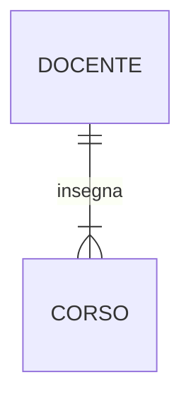
Diventa:
```sql
CREATE TABLE Docente (
    id   INTEGER PRIMARY KEY,
    nome TEXT NOT NULL
);

CREATE TABLE Corso (
    id         INTEGER PRIMARY KEY,
    nome_corso TEXT NOT NULL,
    docente_id INTEGER,
    FOREIGN KEY (docente_id) REFERENCES Docente(id)
);
```
> La FK va nella tabella **CORSO** (il lato "molti")

### Regola 4: Relazione N-a-N → Tabella di Raccordo

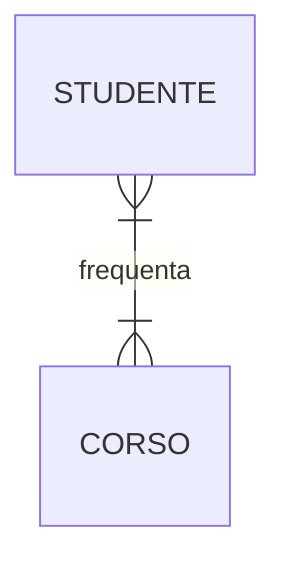
Diventa:
```sql
CREATE TABLE Studente (
    id INTEGER PRIMARY KEY,
    nome TEXT NOT NULL
);

CREATE TABLE Corso (
    id INTEGER PRIMARY KEY,
    titolo TEXT NOT NULL
);

-- Tabella di raccordo (junction table)
CREATE TABLE Iscrizione (
    studente_id INTEGER,
    corso_id    INTEGER,
    PRIMARY KEY (studente_id, corso_id),
    FOREIGN KEY (studente_id) REFERENCES Studente(id),
    FOREIGN KEY (corso_id)    REFERENCES Corso(id)
);
```

---

## 7. Altri Tipi di Diagrammi Mermaid

Mermaid supporta molti tipi di diagrammi. Ecco i principali:

### 7.1 Flowchart (Diagramma di flusso)

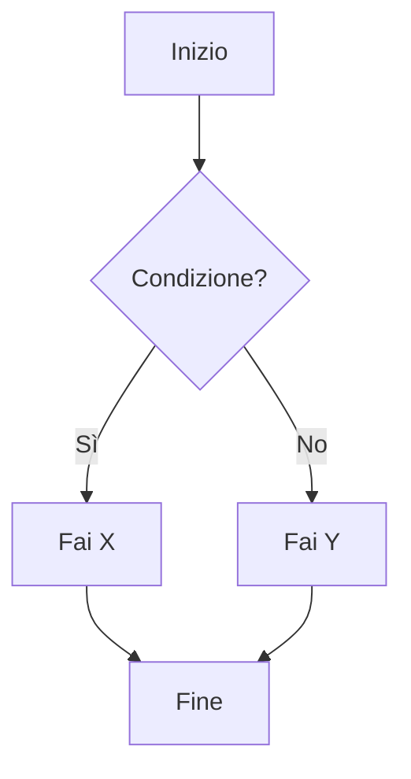

**Sintassi nodi:**
- `[Testo]` → rettangolo
- `{Testo}` → rombo (decisione)
- `(Testo)` → stadium (arrotondato)
- `((Testo))` → cerchio

**Direzione:** `TD` = Top-Down, `LR` = Left-Right

### 7.2 Sequence Diagram

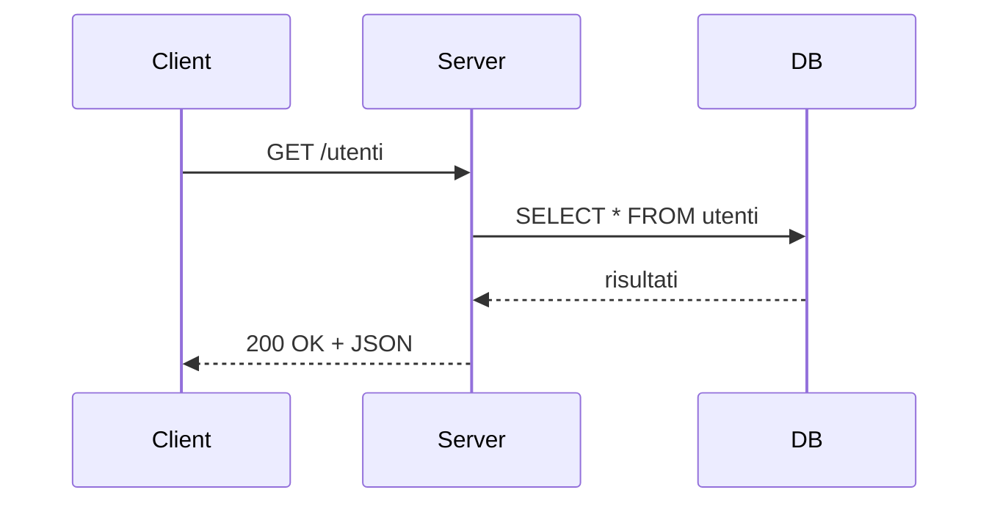

Utile per rappresentare il flusso di una richiesta HTTP/API.

### 7.3 Class Diagram

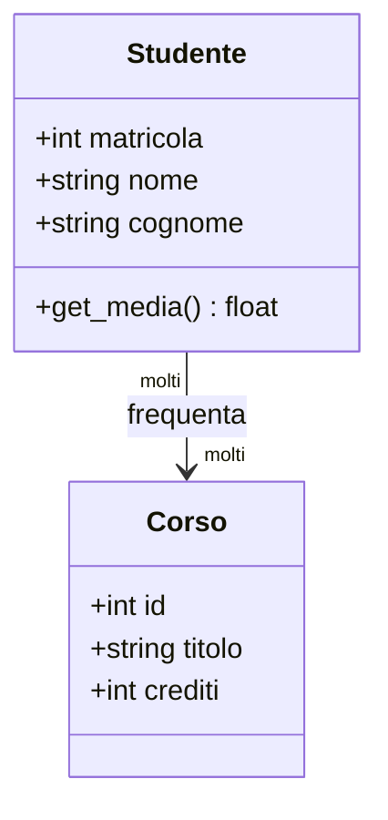

### 7.4 State Diagram

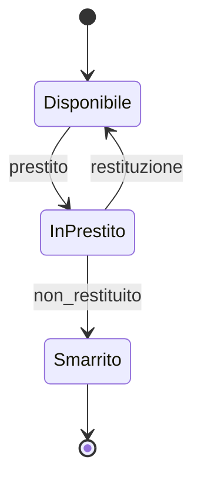

---

## 8. Errori Comuni

### ❌ Errore 1: Nomi con spazi

```
erDiagram
    TIPO MIELE    ← ERRORE! Lo spazio spezza il nome
```
✅ Soluzione: usa underscore
```
erDiagram
    TIPO_MIELE
```

### ❌ Errore 2: Mettere la FK nel lato sbagliato

In una relazione 1-a-N `DOCENTE ||--|{ CORSO`:
- ❌ La FK NON va in `DOCENTE`
- ✅ La FK va in `CORSO` (il lato "molti")

### ❌ Errore 3: Dimenticare la tabella di raccordo per N-a-N

Una relazione N-a-N (`STUDENTE }|--|{ CORSO`) **non si può** implementare direttamente con una FK. Serve sempre una tabella di raccordo (es. `ISCRIZIONE`).

### ❌ Errore 4: Relazione senza verbo

```
erDiagram
    DOCENTE ||--|{ CORSO    ← ERRORE! Manca il verbo
```
✅ Soluzione:
```
erDiagram
    DOCENTE ||--|{ CORSO : insegna
```

### ❌ Errore 5: Attributo PK non dichiarato

Ogni entità deve avere almeno un attributo `PK`. Senza PK il database non può identificare univocamente le righe.

---

*Fine Guida Mermaid — per gli esercizi vedi `04_ESERCIZI_MERMAID.md`*
