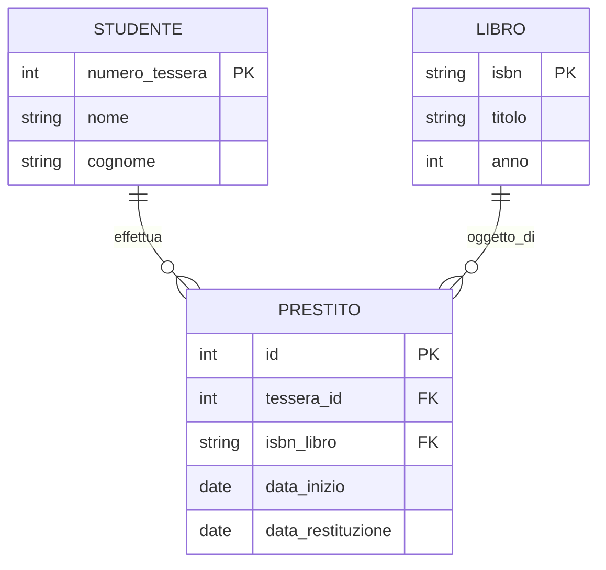
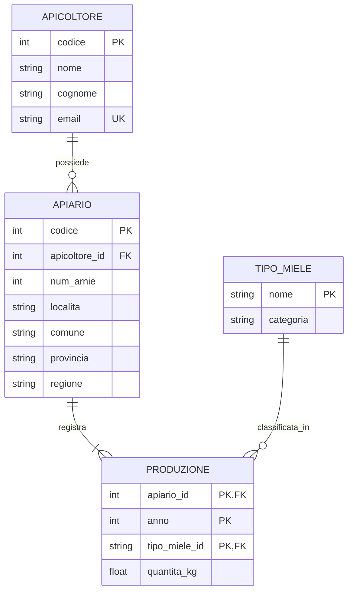
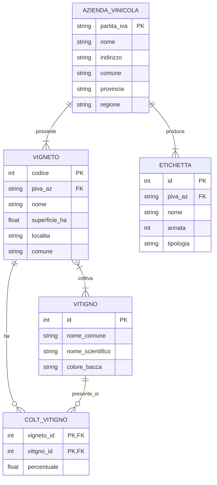
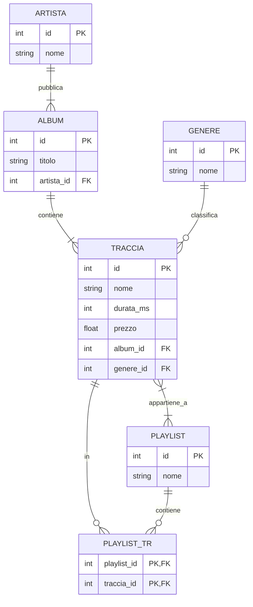
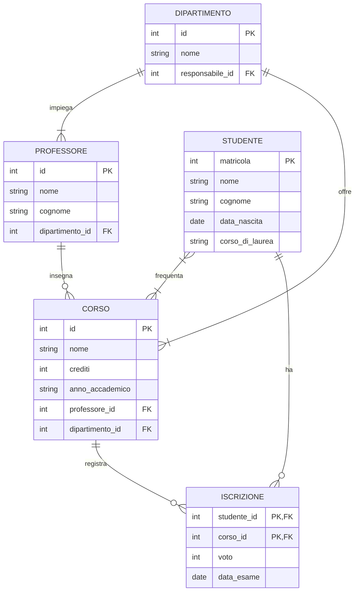
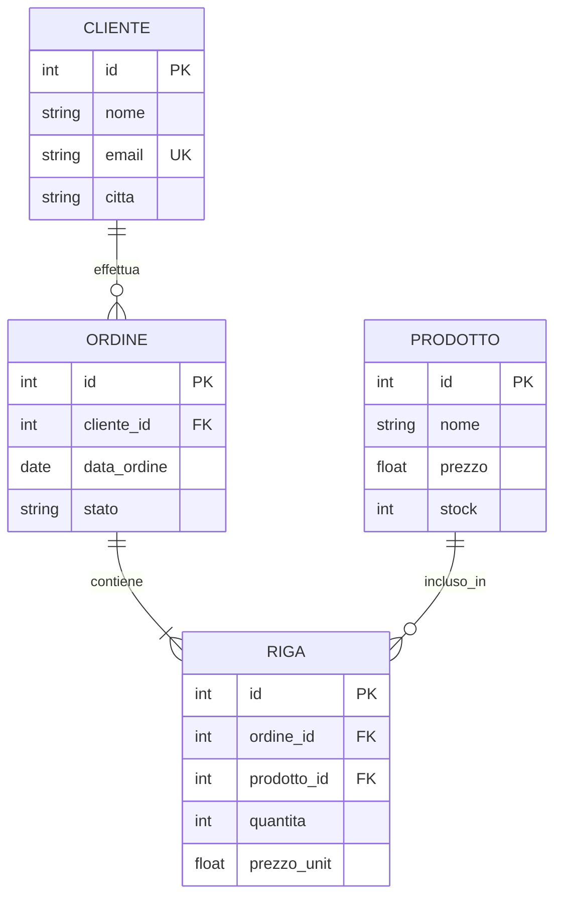
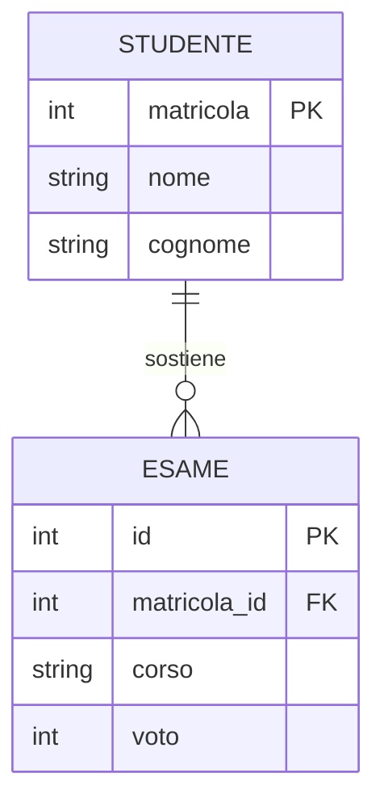

# Esercizi — Diagrammi Mermaid ER

> Basati sul materiale di [angelogalantiscuola/2526_5M](https://github.com/angelogalantiscuola/2526_5M)  
> Per la teoria consulta `01_GUIDA_MERMAID.md`

---

## Come usare questi esercizi

1. Leggi il testo dell'esercizio
2. Prova a disegnare il diagramma da solo
3. Controlla la soluzione proposta
4. Verifica che la traduzione SQL sia coerente

Per testare i diagrammi usa:
- GitHub (incolla in un file `.md`)
- [mermaid.live](https://mermaid.live) — editor online gratuito

---

## Esercizio 1 — Biblioteca Scolastica ⭐ (Facile)

### Testo

Una biblioteca scolastica gestisce libri e studenti. Ogni libro ha un ISBN, un titolo e un anno di pubblicazione. Ogni studente ha un numero di tessera, nome e cognome. Uno studente può prendere in prestito più libri, ma ogni prestito riguarda un solo libro e un solo studente. Del prestito si registra la data di inizio e la data di restituzione (che può essere nulla se il libro non è stato ancora restituito).

### Guida passo-passo

1. Identifica le **entità** (le "cose" da memorizzare):
   - Libro, Studente, Prestito

2. Per ogni entità, elenca gli **attributi**

3. Identifica le **relazioni**:
   - Studente ↔ Prestito: uno studente ha molti prestiti → relazione **1-a-N**
   - Libro ↔ Prestito: un libro ha molti prestiti nel tempo → relazione **1-a-N**

4. Disegna il diagramma

### Soluzione



### Traduzione SQL

```sql
CREATE TABLE Studente (
    numero_tessera INTEGER PRIMARY KEY,
    nome           TEXT NOT NULL,
    cognome        TEXT NOT NULL
);

CREATE TABLE Libro (
    isbn   TEXT PRIMARY KEY,
    titolo TEXT NOT NULL,
    anno   INTEGER
);

CREATE TABLE Prestito (
    id                INTEGER PRIMARY KEY AUTOINCREMENT,
    tessera_id        INTEGER NOT NULL,
    isbn_libro        TEXT NOT NULL,
    data_inizio       DATE NOT NULL,
    data_restituzione DATE,
    FOREIGN KEY (tessera_id)  REFERENCES Studente(numero_tessera),
    FOREIGN KEY (isbn_libro)  REFERENCES Libro(isbn)
);
```

### Domande di riflessione

- Perché `data_restituzione` non ha `NOT NULL`?
- Come troveresti i prestiti non restituiti? (Suggerimento: `IS NULL`)
- Come troveresti tutti i libri presi in prestito da uno studente specifico?

---

## Esercizio 2 — Apicoltura Italiana ⭐⭐ (Medio)

### Testo

Dal repository `2526_5M`, esercizio `es01_testo.md`:

Un sistema per catalogare la produzione di miele italiano. Ogni **apicoltore** è identificato da un codice, nome, cognome e email. Ogni apicoltore gestisce uno o più **apiari**. Ogni apiario è identificato da un codice e ha: numero di arnie, localita, comune, provincia, regione. Ogni apiario produce un solo **tipo di miele** per anno. Il tipo di miele ha un nome e una categoria (nazionale, regionale, territoriale, DOP). Del **tipo di miele** si vuole tracciare la produzione annuale (quantità in kg) per ogni apiario.

### Guida passo-passo

1. Entità principali: **Apicoltore**, **Apiario**, **TipoMiele**
2. La produzione annuale lega Apiario + TipoMiele + anno → tabella di raccordo **Produzione**
3. Relazioni:
   - Apicoltore **possiede** Apiario → 1-a-N
   - Apiario **registra** Produzione → 1-a-N
   - TipoMiele **classificata_in** Produzione → 1-a-N

### Soluzione



### Traduzione SQL

```sql
CREATE TABLE Apicoltore (
    codice  INTEGER PRIMARY KEY,
    nome    TEXT NOT NULL,
    cognome TEXT NOT NULL,
    email   TEXT UNIQUE
);

CREATE TABLE Apiario (
    codice        INTEGER PRIMARY KEY,
    apicoltore_id INTEGER NOT NULL,
    num_arnie     INTEGER NOT NULL,
    localita      TEXT,
    comune        TEXT,
    provincia     TEXT,
    regione       TEXT,
    FOREIGN KEY (apicoltore_id) REFERENCES Apicoltore(codice)
);

CREATE TABLE TipoMiele (
    nome      TEXT PRIMARY KEY,
    categoria TEXT NOT NULL
);

CREATE TABLE Produzione (
    apiario_id    INTEGER NOT NULL,
    anno          INTEGER NOT NULL,
    tipo_miele_id TEXT    NOT NULL,
    quantita_kg   REAL,
    PRIMARY KEY (apiario_id, anno, tipo_miele_id),
    FOREIGN KEY (apiario_id)    REFERENCES Apiario(codice),
    FOREIGN KEY (tipo_miele_id) REFERENCES TipoMiele(nome)
);
```

---

## Esercizio 3 — Azienda Vinicola ⭐⭐ (Medio)

### Testo

Dal repository `2526_5M`, esercizio `es07_testo.md`:

Un sistema per gestire aziende vinicole italiane. Ogni **azienda vinicola** ha partita IVA, nome, indirizzo, comune, provincia e regione. Un'azienda possiede uno o più **vigneti**. Ogni vigneto ha: codice, nome, superficie in ettari, localita, comune. Un vigneto è coltivato con uno o più **vitigni** (es. Sangiovese, Trebbiano) e ogni vitigno può essere in più vigneti (relazione N-a-N). Ogni azienda produce **etichette/prodotti** (vini): ogni etichetta ha nome, annata e tipologia (DOC, IGT, ecc.).

### Guida passo-passo

1. Entità: **AziendaVinicola**, **Vigneto**, **Vitigno**, **Etichetta**
2. Relazioni:
   - AziendaVinicola → Vigneto: 1-a-N
   - Vigneto ↔ Vitigno: N-a-N → tabella raccordo `ColtivazioneVitigno`
   - AziendaVinicola → Etichetta: 1-a-N

### Soluzione



---

## Esercizio 4 — Music Store ⭐⭐ (Medio)

### Testo

Dal database `2526_5M/db/music-store.sql`. Modella le seguenti entità di un negozio musicale:
- **Artista**: id, nome
- **Album**: id, titolo, collegato a un artista
- **Traccia**: id, nome, durata, prezzo, collegata a un album e a un genere
- **Genere**: id, nome
- **Playlist**: id, nome
- Una traccia può stare in più playlist, una playlist ha più tracce (N-a-N)

### Soluzione



---

## Esercizio 5 — Sistema Universitario ⭐⭐⭐ (Difficile)

### Testo

Modella un sistema universitario completo:
- **Studente**: matricola, nome, cognome, data di nascita, corso di laurea
- **Professore**: id, nome, cognome, dipartimento
- **Corso**: id, nome, crediti, anno accademico
- Un corso è tenuto da un professore
- Uno studente può iscriversi a molti corsi (N-a-N) e per ogni iscrizione si registra il voto e la data dell'esame
- Un professore può tenere più corsi
- Un corso appartiene a un **dipartimento**
- Il **dipartimento** ha: id, nome, responsabile (che è un professore)

### Guida passo-passo

1. Entità: **Studente**, **Professore**, **Corso**, **Dipartimento**
2. Tabella raccordo N-a-N: **Iscrizione** (Studente ↔ Corso)
3. Il campo `responsabile` in Dipartimento è una FK verso Professore (auto-referenziale indiretto)

### Soluzione



### Traduzione SQL — parte difficile

```sql
-- Il dipartimento deve essere creato PRIMA del professore
-- (FK responsabile_id → professore, ma professore → dipartimento)
-- Soluzione: aggiungere responsabile_id come ALTER TABLE dopo

CREATE TABLE Dipartimento (
    id   INTEGER PRIMARY KEY,
    nome TEXT NOT NULL
);

CREATE TABLE Professore (
    id              INTEGER PRIMARY KEY,
    nome            TEXT NOT NULL,
    cognome         TEXT NOT NULL,
    dipartimento_id INTEGER,
    FOREIGN KEY (dipartimento_id) REFERENCES Dipartimento(id)
);

-- Aggiungiamo il responsabile dopo
ALTER TABLE Dipartimento ADD COLUMN responsabile_id INTEGER
    REFERENCES Professore(id);
```

---

## Esercizio 6 — Lettura di un Diagramma Esistente ⭐ (Facile)

### Testo

Leggi questo diagramma e rispondi alle domande:



### Domande

1. Quanti ordini può fare un cliente? *(Guarda la cardinalità)*
2. Un ordine deve avere almeno una riga? *(Guarda il simbolo `|{`)*
3. Quale tabella ha due chiavi esterne?
4. Come si chiama la FK che collega RIGA a ORDINE?
5. Che tipo di relazione c'è tra ORDINE e PRODOTTO?

### Risposte

1. **Zero o più** (`o{` → zero o molti ordini)
2. **Sì**, `|{` significa "uno o più" → almeno una riga
3. **RIGA** (ha sia `ordine_id FK` che `prodotto_id FK`)
4. **`ordine_id`**
5. È una relazione **N-a-N** mediata dalla tabella di raccordo `RIGA`

---

## Esercizio 7 — Trova gli Errori ⭐⭐ (Medio)

### Testo

Il diagramma seguente contiene **5 errori**. Trovali e correggi.

```
erDiagram
    STUDENTE |--o{ ESAME : sostiene
    
    STUDENTE {
        string nome
        string cognome
    }
    
    ESAME {
        int id PK
        string STUDENTE FK
        string corso
        int voto
    }
```

### Soluzione — Errori e correzioni

| # | Errore | Correzione |
|---|---|---|
| 1 | Cardinalità `\|--` non valida | Deve essere `\|\|--` (due pipe) |
| 2 | STUDENTE non ha `PK` | Aggiungere `matricola INTEGER PK` |
| 3 | Manca il verbo nella relazione | Aggiungere `: sostiene` (già presente, OK) |
| 4 | FK in ESAME ha tipo `string` invece di `int` | Cambiare in `int matricola_id FK` |
| 5 | Il nome dell'attributo FK è "STUDENTE" (confonde entità e colonna) | Rinominare in `matricola_id FK` |

### Diagramma corretto



---

## Riepilogo Cardinalità — Tabella di Riferimento

| Da costruire | Simbolo sinistro | Tratto | Simbolo destro | Esempio |
|---|---|---|---|---|
| Uno e solo uno | `\|\|` | `--` | `\|\|` | Persona ↔ Carta d'identità |
| Uno a molti | `\|\|` | `--` | `\|{` | Docente → Corsi |
| Zero o uno a molti | `o\|` | `--` | `o{` | Cliente → Ordini (anche senza ordini) |
| Molti a molti | `}\|` | `--` | `\|{` | Studenti ↔ Corsi |

---

*Fine Esercizi Mermaid — vedi anche `05_ESERCIZI_SQL_SQLITE3.md` e `06_ESERCIZI_PYTHON_API.md`*
